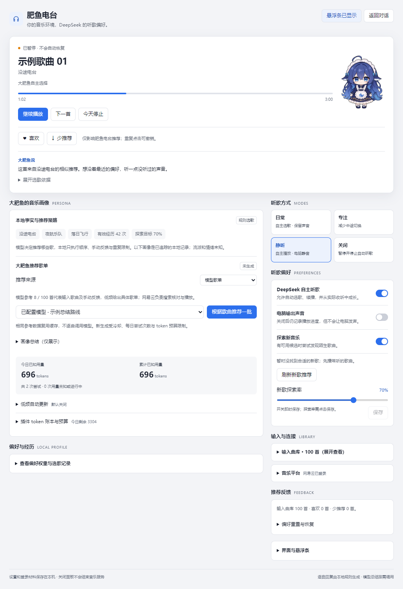
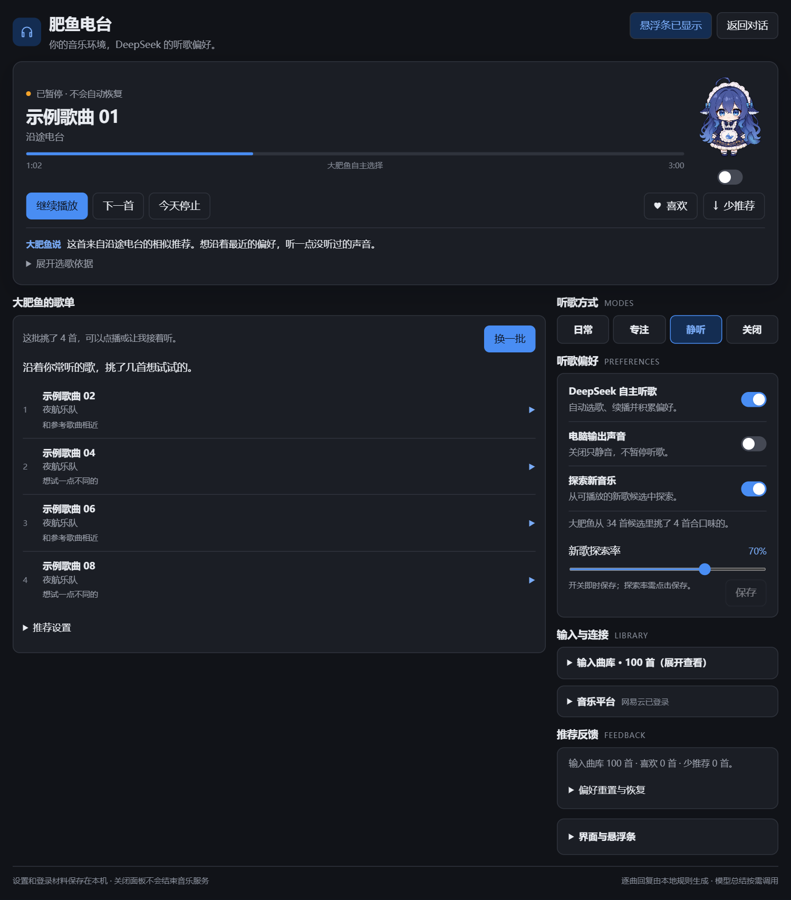

# 肥鱼电台 FishFM

给正在 DSH 里工作的 DeepSeek 一副耳机。

<p>
  
</p>

**FishFM 是 DeepSeek Harness（DSH）的社区音乐插件。** 导入你的网易云音乐，以常听歌曲为起点建立本地音乐偏好，让大肥鱼自主选歌、探索新歌；你可以随时点播、暂停、换曲或静音。

[开始使用](#开始使用) · [功能介绍](#能做什么) · [开发与贡献](CONTRIBUTING.md) · [验收进度](docs/PROJECT_PLAN.md) · [MIT 许可证](LICENSE)

## 界面预览



<details>
<summary>查看深色界面</summary>



</details>

以上截图来自当前客户端的隔离预览，使用模拟歌曲和统计数据，不代表真实账号记录或模型效果。主面板、设置页和可隐藏的悬浮条共用同一个音乐服务；切换 DSH 页面或隐藏控件后仍可继续播放。

## 能做什么

| 功能 | 使用方式 |
| --- | --- |
| 导入你的音乐 | 网易云扫码登录，从近期播放、喜欢的歌曲或指定歌单建立输入曲库 |
| 自主听歌 | 按本地偏好、歌曲关系与重复惩罚选择歌曲，曲终继续播放；用户暂停优先 |
| 找新歌 | 结合相似歌曲、每日推荐和个人歌曲关系，按探索率尝试陌生候选 |
| 可选模型推荐 | 使用 DSH 已配置的模型生成具体歌单、批量筛选新歌或总结音乐偏好 |
| 看懂选歌理由 | 查看「大肥鱼说」、艺人倾向、有效收听和近期偏好变化；未知信息保持未知 |
| 调整推荐 | 对歌曲点「喜欢 / 少推荐」并撤销；偏好重置和输入曲库清空分别提供恢复入口 |
| 控制听歌状态 | 暂停、继续、下一首，以及日常、专注、静听、关闭和「今天停止」 |
| 随时收起 | DSH 内悬浮条可隐藏、重开、拖动和吸附；支持浅色、深色与减少动态效果 |

「静听」会关闭电脑声音，让自主听歌与有效经历继续。音乐偏好、用户反馈和禁播约束分别保存，平台请求失败不会被当成不喜欢一首歌，反馈也不会改动网易云收藏。

### 推荐怎样运行

```text
你的常听歌曲 / 喜欢 / 歌单
          ↓
本地画像与歌曲关系 → 候选召回 / 可选模型歌单与筛选
          ↓
本地逐曲选歌 → 平台核对与资源解析 → 独立播放服务
          ↓
有效收听记录 → 有界偏好更新 → 下一次选择
```

**逐曲选歌、播放和偏好更新不请求模型。** 画像总结、模型歌单、发现候选筛选是低频操作，共用 token 预算，并受冷却与每日上限约束；成功和失败的调用都会记录到账本。自动更新可关闭，模型不可用时界面展示实际状态。

模型歌单会先搜索核对，再播放可匹配的歌曲。歌单暂时没有可播曲目时，用户主动点「下一首」可回退输入曲库并显示原因；自主续播保持歌单边界。完整行为见 [产品规格](docs/MVP.md)。

## 开始使用

### 环境要求

| 项目 | 要求 |
| --- | --- |
| 系统 | Windows；当前真实音频后端使用 WPF `MediaPlayer` |
| Node.js | `>=24.14.0 <25`，以 `package.json` 为准 |
| 宿主 | DSH 桌面版；本机验证版本为 `0.2.0-rc.2`，其他版本需自行验证 |
| 音乐账号 | 网易云音乐；可播放范围取决于账号权限和平台资源 |
| 模型 | 可选，使用 DSH 中已配置的模型；离线开发检查不需要模型或音乐账号 |

### 安装到 DSH

```sh
git clone https://github.com/A7m0spHere/dsh-feiyuFM.git
cd dsh-feiyuFM
npm ci --ignore-scripts --no-audit --no-fund
npm run build
```

1. 在 DSH 的插件管理界面选择添加插件，输入克隆仓库的**绝对目录**并启用。
2. 点击左侧栏 **肥鱼电台**，或进入 **账号菜单 → 设置 → 肥鱼电台**。
3. 在网易云卡片点击 **扫码登录**，使用手机确认，再点击 **导入我的音乐**。
4. 选择输入曲库中的歌曲点播，或设置自主听歌与声音开关。模型歌单入口需要先选择可用模型并完成生成、核对。

插件以仓库 bundle 加载，`dist/` 是开发构建产物。当前没有 npm 发布包或安装器。更新与排障见 [交付与使用说明](docs/DELIVERY.md)。

## 当前进度

**开发预览，尚未完成 v0.1 发布验收。** 网易云真实扫码、导入、播放、自然续播、部分偏好成长、设置持久化与停用恢复已验证；完整验收状态以 [开发路线](docs/PROJECT_PLAN.md) 为准。

- 2026-10-06 的仓库实现已推进到 N19：慢媒体打开可被暂停、停止或下一首取消；WPF 音频预热池将预热完成后的切歌打开时间从约 4.6–10.2 秒降至约 0.35–0.45 秒。最近记录为 **382 项测试通过、117 个模块检查通过，构建通过**，详见 [N19 验证记录](docs/spikes/N19-wpf-audio-warmup.md)。
- 首次播放仍约 5.5 秒；预热池约需 15 秒填满，填充期间切歌可能略慢。可设 `FISHFM_PLAYBACK_WARM_HOLDERS=0` 关闭预热。N12–N19 尚未重载到生产宿主；真实模型筛选质量、进度观感和部分故障恢复仍待现场验证。
- 真实两小时运行、DSH 模型请求/上下文对照与完整多会话验收尚未完成。
- QQ 音乐保留在规划与适配代码中，接入暂缓；当前不提供可用的 QQ 登录与播放链路。其他操作系统未验证。

## 数据与模型

播放核心独立于可见 UI。默认数据存于 `$DSH_HOME/fishfm/music.sqlite`，常见本机位置为 `~/.dsh/fishfm/music.sqlite`。网易云会话使用 Windows DPAPI 加密，数据库只保存凭据引用；运行数据库、Cookie 和音频不会随仓库同步。

使用模型功能时，会发送受大小上限约束的歌曲名称、艺人、反馈与关系等音乐事实；歌单生成不发送平台 ID；候选筛选会发送用于匹配结果的曲目键（含平台与歌曲 ID）。Cookie 和凭据不进入模型事实包。具体字段、预算与持久化边界见 [架构](docs/ARCHITECTURE.md) 和 [控制契约](docs/CORE_CONTRACT.md)。

## 开发

```sh
npm run check             # 模块语法、Node 版本与生成客户端一致性
npm test                  # 核心、适配器、桥接与 UI 逻辑测试
npm run build             # 生成客户端、构建 dist/ 并运行调试冒烟
npm run audit:acceptance  # 验收证据引用审计，不代表真实验收通过
npm run debug             # JSON 行调试入口，使用假播放，不出声
```

客户端源码在 `src/ui/client/`，`src/ui/dsh-client.js` 为生成文件。修改 UI 后执行 `npm run build:client`；隔离预览需要已有 React 18 UMD，详见 [贡献指南](CONTRIBUTING.md)。

## 文档导航

| 文档 | 内容 |
| --- | --- |
| [交付与使用说明](docs/DELIVERY.md) | 安装、更新、数据位置与常见问题 |
| [产品规格](docs/MVP.md) | 用户操作、推荐边界与验收标准 |
| [开发路线](docs/PROJECT_PLAN.md) | 实施进度、真实验收与跨设备交接 |
| [架构](docs/ARCHITECTURE.md) | Provider、Core、Playback 和 UI 的职责 |
| [控制契约](docs/CORE_CONTRACT.md) | 内部命令、状态与存储语义 |
| [决策记录](docs/DECISIONS.md) | 实现取舍与来源证据 |
| [贡献指南](CONTRIBUTING.md) | 本地开发、问题反馈和提交要求 |

## 许可与致谢

项目原创代码与文档采用 [MIT License](LICENSE)。第三方依赖、适配代码和素材按各自的许可与来源说明处理，见 [第三方声明](THIRD_PARTY_NOTICES.md)。用户提供的锅盖鲸鱼娘 GIF 及衍生素材作者与许可尚未确认，**不包含在本项目 MIT 授权范围内**；界面截图中对应的角色图像也保留这一边界。

感谢 DSH、网易云社区 API，以及提供 UI 风格和交互参考的 PHL、dsh-api-dashboard 与 DeepSeek Balance Whale Widget。具体版本、复用范围和声明见第三方文档。FishFM 为独立维护的社区项目。
