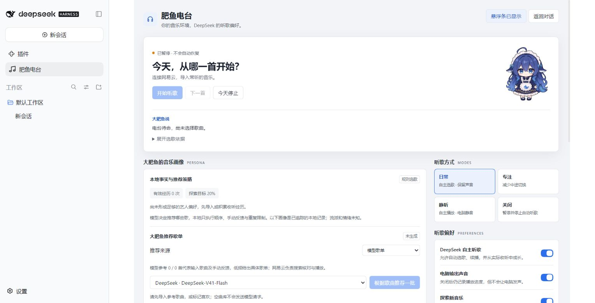

# 0.1.0-beta.1 首包发布记录

日期：2026-10-06。状态：发布候选，等待最后检查与 npm 发布确认。

## 范围与安装

包名 `dsh-feiyufm-core`，版本 `0.1.0-beta.1`，发布到公开 npm 的 `beta` 标签。首包限定 Windows、Node `>=24.14.0 <25` 和网易云。本机用官方 DSH `0.2.0-rc.2` 的隔离 Web profile 验证。QQ 暂缓，两小时、完整多会话与长期质量仍未通过，不能称为双平台稳定 MVP。

在 DSH「插件 → 添加插件」输入 `dsh-feiyufm-core@0.1.0-beta.1`，安装后启用；跟随测试版可用 `dsh-feiyufm-core@beta`。已有 workspace 安装应通过插件管理器更换来源，不能同一 profile 重复启用两份 FishFM。登录网易云由用户扫码，模型功能复用用户自己的 DSH 配置。

## 包与许可

`files` 白名单保留入口、Core、客户端、WPF、自有三张状态 PNG、许可与使用说明。用户 GIF/衍生图、原型、实验、测试及运行数据不分发。

消费者不会沿用开发仓库的 `overrides`；单独 shrinkwrap 实测也没保留强制版本。因此封装已验证运行依赖树，并携带 `npm-shrinkwrap.json`。npm 消费者和 DSH pnpm 安装均实际解析到 `basic-ftp@6.2.2`。封装增加包体积，换取安装不重新解析/下载依赖。

287 个运行依赖声明见 [DEPENDENCY_LICENSES](../../DEPENDENCY_LICENSES.md)。保留上游源码与许可；`@unblockneteasemusic/server` 保留 LGPL-3.0-only 的 JavaScript 源码、COPYING/COPYING.LESSER，`node-forge` 使用 BSD-3-Clause 选项；项目 MIT 不覆盖它们。

## 剩余依赖告警

FTP/PAC/get-uri 告警链已更新。开发审计剩余 2 个 high 受影响包名：`node-forge` 和由它传播的网易云社区 API。

[GHSA-86w9-cpqp-85rv](https://github.com/advisories/GHSA-86w9-cpqp-85rv) 涉及 RSA PKCS#1 v1.5 签名校验，公告没有修复版本。固定 API 的 `util/crypto.js` 使用 `forge.pki.publicKeyFromPem` 和 `publicKey.encrypt(..., 'NONE')`，未调用签名校验；FishFM 不暴露验签入口。本次据静态调用路径保留依赖，没有声称告警已修复或零风险。后续引入验签需重新评估。

## 自适应预热

发布全量检查复现固定 5 个持有者仍加载 4684ms。默认从 5 个开始，依据真实 Open 的单调耗时有界补齐，最多 8 个。达到最低数量且最近 Open <1500ms，或达到上限，才报告完成。真实 load 仍优先，持有者从不播放。

显式 `FISHFM_PLAYBACK_WARM_HOLDERS=0..8` 保持固定数量，0 关闭。默认模式不是跨设备速度保证。独立回归用 6 个持有者，冷 6614ms、后续 484ms；保留 load <2s 且 <冷 load 一半断言。

## 验证

- 仓库外 npm 实包与 DSH pnpm 包安装：实际 FTP 6.2.2，入口/三张 PNG/Core 启动暂停退出/真实 WPF 新快照均 `ALL-PASS`。
- 官方 rc.2 隔离 profile 经其 CLI/Plugin Manager 安装 tarball，组成 fishfm 插件行，启动真实 DSH 页面。
- 页面验证：侧栏与悬浮条、主面板、自有 PNG 解码、声音开关保存及刷新保持、今天停止/恢复入口、空曲库 `no_candidates` 与 Core 在线均通过；控制台无 error，模型账本 0 次。
- Chrome 控制不可用，实际用已连接 Edge。新 profile 未登录、曲库为空，不使用生产数据库或用户平台账号；截图不能充当平台播放证据。

最终源码验证：386/386 测试、121 模块检查、构建/调试冒烟与 66 份文档引用审计通过。本轮完整性和 npm 标签确认在发布后补齐。
